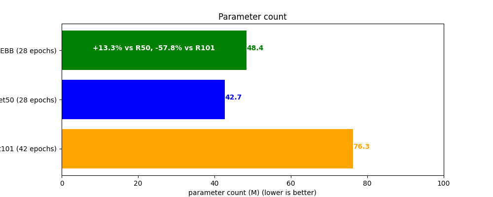

<h2 align="center">RT-YODETR: Modified RT-DETR with YOLO (v9) backbone </h2>
<h4 align="center">Official RT-DETR repository: https://github.com/lyuwenyu/RT-DETR </h4>
<h4 align="center">Official YOLOv9 repository: https://github.com/WongKinYiu/yolov9 </h4>

    <!--  -->
    
    
    
    
    <a href="">
        <!--img alt="arXiv" src="https://img.shields.io/badge/arXiv-2304.08069-red"-->
        PAPER SOON PUBLISHED
    </a>
    

---

Figures

|  | Model | mAP 50:95 | Params | Inference time on 1 image RTX-3050 Mobile | Epoch |
|---|---|---|---|---|---|
| 2 | RT-DETR-L-YOLOv9Ebb | 0.502 | 48400298 | 0.1297 | 27 |
| 3 | RT-DETR-L-R50 | 0.42 | 42702570 | 0.1124 | 27 |
| 4 | RT-DETR-L-R101 | 0.4333 | 76395978 | 0.1516 | 42 |

**The existing weight is trained with trimmed COCO dataset**
This research is quite constrained with the budget, so to train enough models, we have to trim the COCO dataset with specific below:

| Stage | Class/label | Total image count | Total annotation count | Image count used in this training | Annotation count used in this training |
|---|---|---|---|---|---|
| Training | person | 64115 | 269578 | 5000 | 20753 |
| Training | bicycle | 3252 | 269578 | 3252 | 23261 |
| Validation | person | 2693 | 11320 | 2693 | 11279 |
| Validation | bicycle | 149 | 11320 | 149 | 1118 | 

## Modification & Training Procedure
- Removed auxiliary branch from YOLOv9 E Backbone
- Plug in the backbone into the RT-DETR framework
- Load the YOLOv9 E backbone weight into the new RT-DETR backbone
- Freeze the backbone
- Train & Benchmarking the model

## Citation
Paper publication ASAP